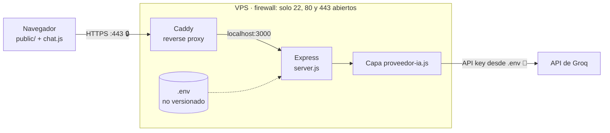

# Chatbot IA

> ✅ **Estado: completado y en producción** — <https://chat.notbot.pro>

Chatbot full stack: un frontend de chat estático servido desde `public/` y una API en Node.js + Express que actúa como **intermediario seguro** hacia la API de Groq. La clave de la API vive solo en el servidor; el navegador nunca la ve.

## Arquitectura



El puerto 3000 no está expuesto a internet: solo Caddy le habla por localhost.

## Decisiones técnicas

- **La API key jamás toca el frontend ni Git**: vive en `.env` (ignorado por Git) y solo la lee el servidor. El navegador habla únicamente con `/api/chat`.
- **Capa de proveedor intercambiable** (`proveedor-ia.js`): la URL, el modelo y el formato de Groq están encapsulados ahí; cambiar de proveedor no toca ni rutas ni frontend.
- **El backend no confía en el cliente**: valida estructura, roles y tamaño del historial recibido antes de reenviar nada a la API externa.
- **Stateless con historial viajando**: el servidor no guarda conversaciones; el frontend envía el historial completo en cada petición.
- **`textContent` para el contenido de la IA**: las respuestas se insertan como texto plano, nunca como HTML, eliminando XSS por contenido generado.
- **Logging sin contenido por privacidad**: se registran metadatos (timestamps, conteos, latencia), nunca el texto de los mensajes.
- **PM2 + Caddy en producción**: PM2 mantiene el proceso vivo y lo levanta al arrancar; Caddy hace de reverse proxy con HTTPS automático (Let's Encrypt).

## Desarrollo local

```bash
npm install
cp .env.example .env   # poner tu API key de Groq (Windows: copy)
npm run dev            # con recarga automática (nodemon)
```

- Chat: <http://localhost:3000>
- Salud: <http://localhost:3000/api/salud>

Sin recarga automática (como en producción): `npm start`.

## Despliegue

Runbook completo paso a paso en [deploy/DESPLIEGUE.md](deploy/DESPLIEGUE.md) y configuración de Caddy en [deploy/Caddyfile.example](deploy/Caddyfile.example).

## Estructura

```
chatbot-ia/
├── public/            # Frontend estático (HTML, CSS, JS del chat)
├── deploy/            # Runbook de despliegue y Caddyfile de producción
├── server.js          # Servidor Express: rutas, validación, logging
├── proveedor-ia.js    # Capa de proveedor de IA (Groq, intercambiable)
├── .env.example       # Plantilla de variables de entorno (versionada)
└── .env               # Configuración real con la API key (NO versionada)
```

## Limitaciones conocidas

- **Sin persistencia de conversaciones**: al recargar la página el historial se pierde; no hay base de datos.
- **Rate limit del free tier de Groq**: bajo uso intenso la API puede devolver 429.
- **Un solo proveedor activo**: la capa es intercambiable, pero no hay fallback automático entre proveedores.
